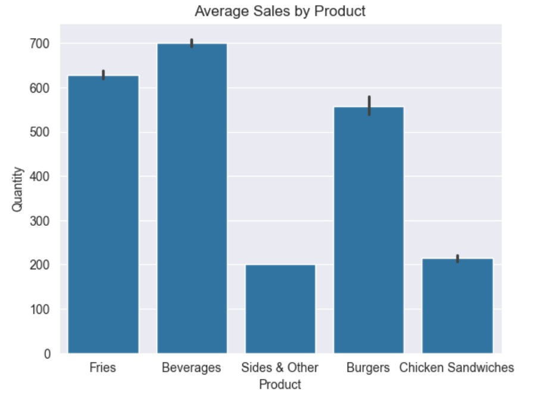
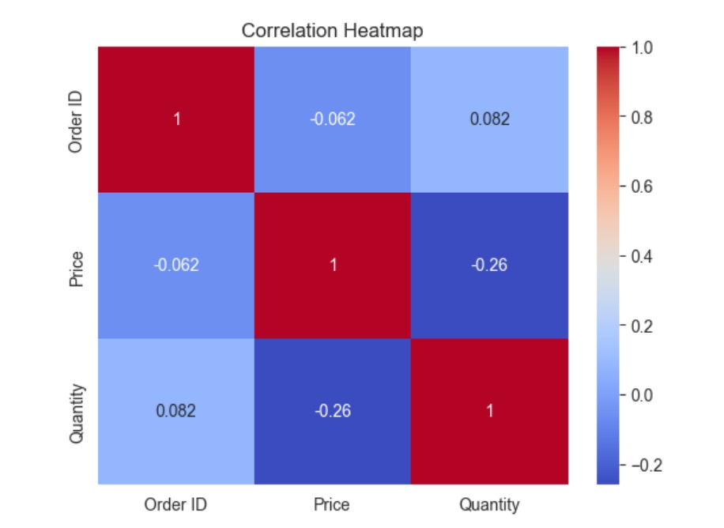
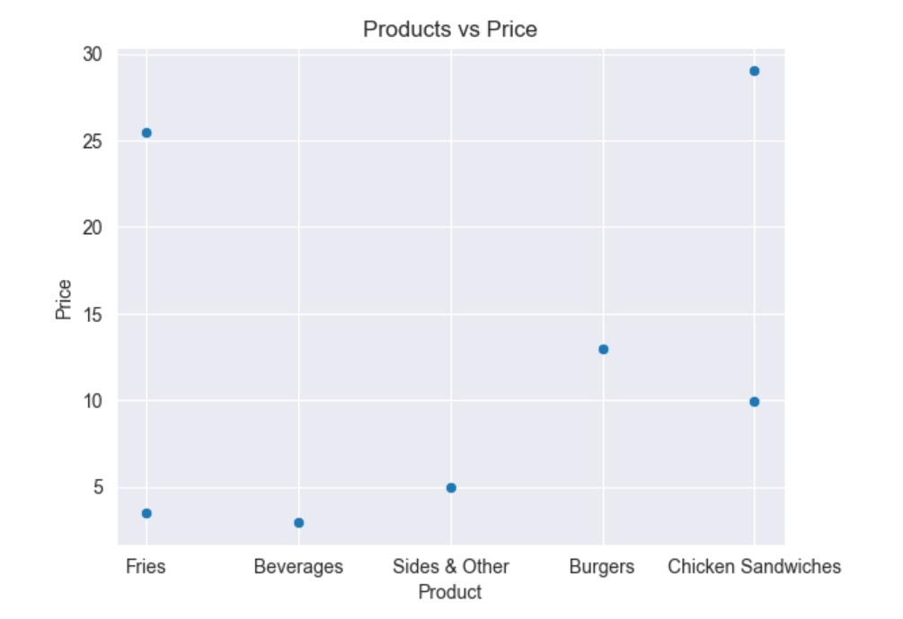
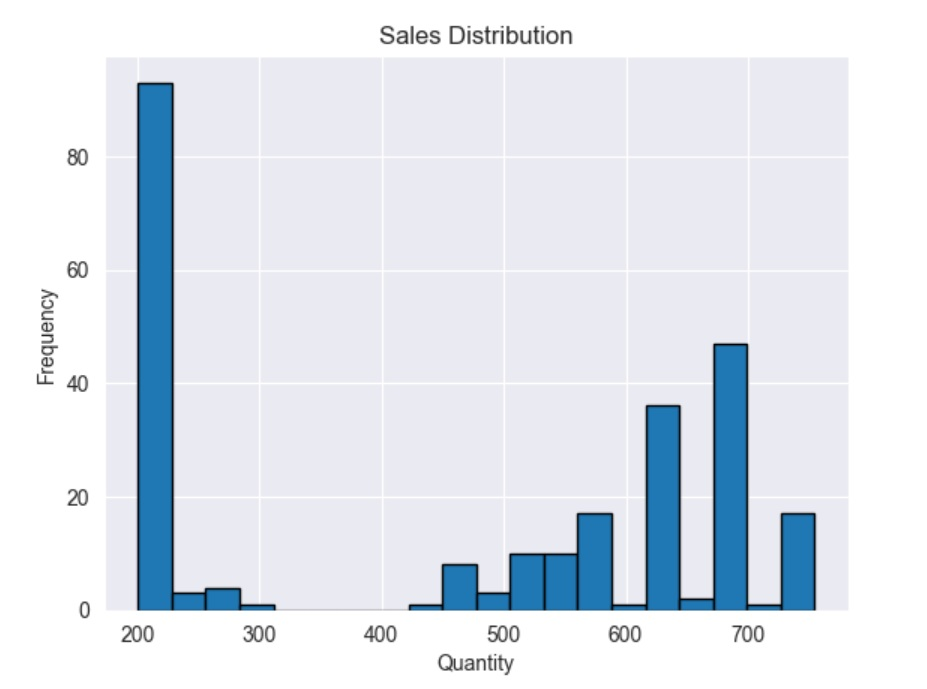
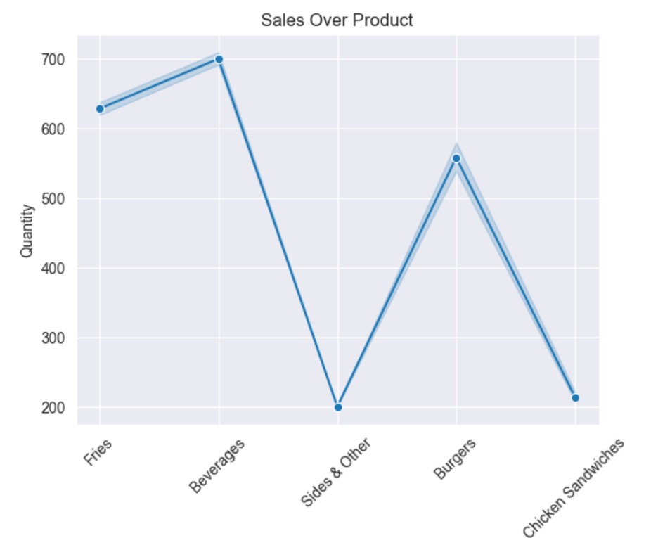
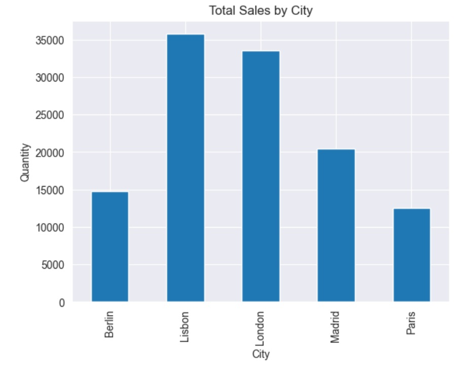
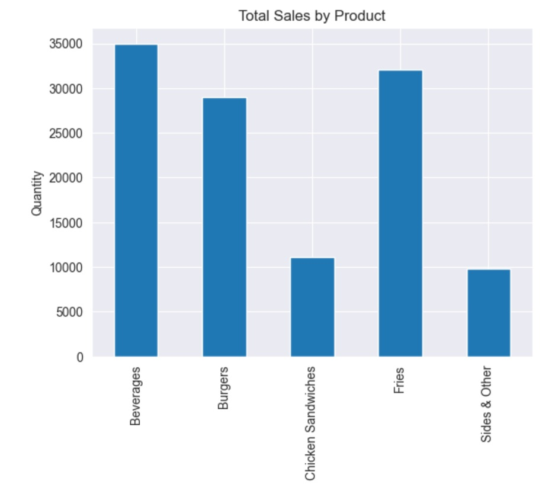

# 🍽️ Restaurant Sales Analysis & Data Visualization

## Project Overview

This project explores transactional sales data from a restaurant company operating across multiple cities worldwide.  
The analysis focuses on understanding sales patterns, product performance, and regional differences using SQL-style data exploration and Python visualizations.

The goal is to demonstrate fundamental data analysis skills, including data aggregation, exploratory analysis, and visualization.

________________________________________

## Dataset

**Name:** Restaurant Sales Data  
**Source:** https://www.kaggle.com/datasets/rohitgrewal/restaurant-sales-data  

The dataset contains individual sales transactions along with customer and operational attributes.  
Each row represents a single order.

________________________________________

## Key Features

- **Order ID** — Unique identifier for each transaction  
- **Order Date** — Date of purchase (enables time-series analysis)  
- **Product** — Product name or category  
- **Price** — Unit price of the item  
- **Quantity** — Number of units purchased  
- **Purchase Type** — Online, in-store, or drive-thru  
- **Payment Method** — Method of payment  
- **Manager** — Store manager name  
- **City** — Location of the store  

________________________________________

## Objectives

- Analyze sales performance by product
- Compare sales across cities
- Explore distribution of order quantities
- Identify relationships between numerical variables
- Demonstrate data visualization techniques in Python

________________________________________

## Data Processing

- Loaded CSV data using Pandas
- Performed grouping and aggregation
- Selected relevant variables for analysis
- Calculated summary statistics
- Prepared data for visualization

________________________________________

## Visualizations

The project includes multiple chart types created with Matplotlib and Seaborn:

### Product Analysis
- Total quantity sold by product (bar chart)
- Average sales by product

### Geographic Analysis
- Total sales by city (bar chart)

### Distribution Analysis
- Histogram of order quantities

### Relationship Analysis
- Scatter plot of price vs product
- Correlation heatmap for numeric features

________________________________________

## Tools & Technologies

- Python
- Pandas
- Matplotlib
- Seaborn

________________________________________

## Use Cases

This type of analysis can support:

- Business intelligence reporting  
- Product performance evaluation  
- Regional strategy decisions  
- Inventory planning  
- Pricing analysis  

________________________________________

## Future Improvements

- Time-series analysis of sales trends
- Customer segmentation
- Revenue forecasting
- Interactive dashboards (Power BI / Tableau)
- SQL-based analytical queries

________________________________________

## Repository Contents

- `Restaurant.csv` — raw dataset  
- Python scripts / notebook — data analysis and visualizations  

________________________________________

## Key dashboards

Average Sales by Product

Correletion HeatMap

Product VS Price

Sales Distribution

Sales Over Product

Total Sales by City

Total Sales by Product

